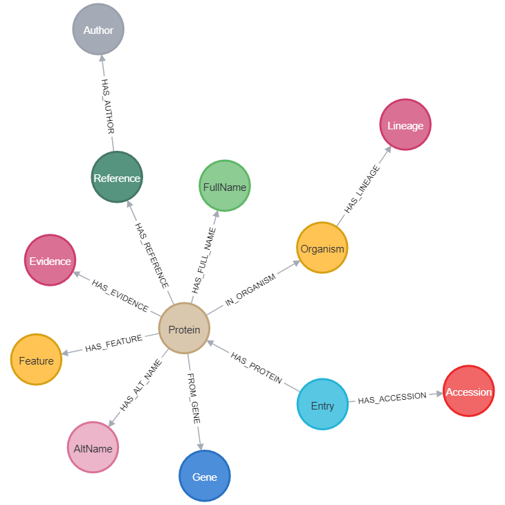

# Coding Challenge Resolution

## Installation

1. Clone the repository
```
git clone https://github.com/Gnk27/Coding-challenge.git
```

2. Install the required dependencies

```
pip install -r requirements.txt
```

## Usage

The `dags` folder contains an initialization file for the DAG responsible for executing `uniprot_reader.py`. This Python script is designed to parse the XML file and upload the extracted data to a graph database. To run the code, an empty Neo4j database named `neo4j` is required, which should be implemented on `bolt://localhost:7687`.

Apart from using Airflow DAG, thee solution can be run with the following command.

```
python unitprot_reader.py
```

## Data model

In the `dat_model` folder an image can be found with the produced data model for this project.



> Presented by: Giancarlo Marquez